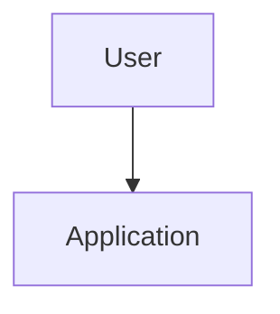

# Architecture Blueprint

## Scope

## Current architecture

## Target architecture

## Areas being edited
| Area | Current location | Planned change | Reason | Risk |
|---|---|---|---|---|

## Interfaces/dependencies
- 

## Data/control flow
1.
2.
3.

## Security boundaries
- 

## Assumptions
- 

## Acceptance criteria mapping
- [ ] AC-001
