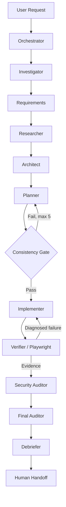

# V2 Architecture

The orchestrator coordinates specialized agents while enforcing permissions,
state transitions, evidence requirements, retry limits and final audit gates.

```mermaid
flowchart TD
    U[User Request] --> O[Orchestrator]
    O --> I[Investigator]
    I --> R[Requirements]
    R --> RS[Researcher]
    RS --> A[Architect]
    A --> P[Planner]
    P --> C{Consistency Gate}
    C -- Fail, max 5 --> P
    C -- Pass --> IM[Implementer]
    IM --> V[Verifier / Playwright]
    V -- Diagnosed failure --> IM
    V -- Evidence --> S[Security Auditor]
    S --> F[Final Auditor]
    F --> D[Debriefer]
    D --> H[Human Handoff]
```
