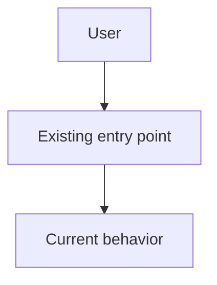
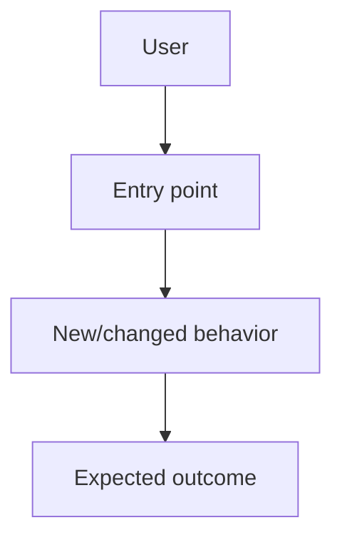

# G&L Auditor V2 — Artifact Templates (Copy-Ready)

These templates are copied into the TARGET repo's `docs/.scratch-audit/` (or `docs/plans/`) during a run — never written into the surgical-implementation skill itself.

Each section below is a self-contained template. Copy the fenced block verbatim into the named file in the run workspace, then fill the placeholders (`<...>`) and tick `[ ]` → `[x]` as each item is satisfied.

File destination per template (relative to `docs/.scratch-audit/`):

| Template | Target file |
|---|---|
| 1 | `REQUIREMENTS.md` |
| 2 | `CODEBASE-STATE.md` |
| 3 | `ARCHITECTURE.md` |
| 4 | `TODO.md` |
| 5 | `debrief.md` |
| 6 | `TRACEABILITY.md` |
| 7 | `SECURITY.md` |
| 8 | `RISK.md` |
| 9 | `research/SOURCES.md` |
| 10 | `research/FINDINGS.md` |
| 11 | `research/DECISIONS.md` |
| 12 | `runtime/manifest.json` |
| 13 | `runtime/state.json` |
| 14 | `runtime/events.jsonl` |

---

## 1. REQUIREMENTS.md

```markdown
# Requirements & Acceptance Criteria

## User request
<!-- Faithful, concise restatement of what the user asked for. Do NOT paraphrase
     away constraints or scope. Capture the original wording where possible. -->

## Functional requirements
- [ ] REQ-001. <functional capability the system must provide>
- [ ] REQ-002. <functional capability the system must provide>
- [ ] REQ-003. <functional capability the system must provide>

## Non-functional requirements
- [ ] NFR-001. <performance / security / accessibility / maintainability expectation>
- [ ] NFR-002. <observability / compatibility expectation>

## Constraints
- <Hard limit: language, framework, target platform, time, must-not-break areas>
- <Must preserve backward compatibility for <surface>>

## Assumptions
- <Belief about the codebase/environment that, if wrong, changes the plan>
- <Assumption is recorded so it can be validated, not silently relied upon>

## Requirement clarification
<!-- Decisions or open questions resolved with the user, if any. -->

## Acceptance criteria
| ID | Criterion | Evidence required |
|---|---|---|
| AC-001 | <observable, testable outcome> | <command output / test name / file diff / screenshot> |
| AC-002 | <observable, testable outcome> | <command output / test name / file diff / screenshot> |
| AC-003 | <observable, testable outcome> | <command output / test name / file diff / screenshot> |
```

---

## 2. CODEBASE-STATE.md

```markdown
# Codebase State

## Run metadata
- Date: <YYYY-MM-DD>
- Repository: <repo name>
- Branch: <branch>
- Commit: <starting commit hash>
- Workflow version: <2.x.x>

## Technology
- Language / runtime:
- Framework:
- Package manager:
- Database:
- Test tooling:

## Baseline file inventory
<!-- The relevant files BEFORE the change. Drive this from a real scan, not memory. -->
| Path | Purpose | Relevance to this task |
|---|---|---|
|  |  |  |
|  |  |  |

## Gate commands + exit codes
<!-- The exact commands used to validate the baseline, with the exit status observed. -->
| Command | Purpose | Exit code | Notes |
|---|---|---|---|
| `<lint cmd>` | static quality | 0 | baseline clean |
| `<typecheck cmd>` | type gate | 0 |  |
| `<test cmd>` | unit/integration | 0 |  |

## Test counts
- Unit: <n> passing / <m> total
- Integration: <n> passing / <m> total
- E2E (Playwright): <n> passing / <m> total
- Baseline conclusion: <GREEN / RED — if RED, list blockers>

## Git state
- Working tree: <clean / dirty>
- Untracked files: <none / list>
- Uncommitted changes: <none / summary>
- Remote ahead/behind: <n>/<m>

## Dependencies / configuration
<!-- Never include secret VALUES. Record names, versions, and config keys only. -->
| Dependency / config | Version / value (non-secret) | Note |
|---|---|---|
|  |  |  |

## Known issues
- <pre-existing bug/tech debt relevant to this work>

## Initial risks
- <risk identified before any change is made>
```

---

## 3. ARCHITECTURE.md

```markdown
# Architecture Blueprint

## Scope
<!-- In scope / out of scope for THIS run. Be explicit about what is excluded. -->

## Current architecture


## Target architecture


## Areas being edited
| Area | Current location | Planned change | Reason | Risk |
|---|---|---|---|---|
|  |  |  |  |  |
|  |  |  |  |  |

## Interfaces / dependencies
- <What this change consumes or must stay compatible with>

## Data / control flow
1. <step>
2. <step>
3. <step>

## Security boundaries
- <Trust boundaries crossed, authn/authz points, untrusted inputs>

## Assumptions
- <architecture-level assumptions, e.g. "endpoint already authenticated">

## Acceptance criteria mapping
- [ ] AC-001 → <where/how satisfied>
- [ ] AC-002 → <where/how satisfied>
```

---

## 4. TODO.md

```markdown
# Implementation TODO

## Objective
<!-- One sentence: the single outcome this run must deliver. -->

## Constraints
- <must not break <area>>
- <must stay within <surface>>

## Objectives
- [ ] OBJ-001. Confirm affected modules and baseline assumptions from CODEBASE-STATE.md.
- [ ] OBJ-002. Confirm or define required interfaces/contracts from ARCHITECTURE.md.
- [ ] OBJ-003. Implement the foundational change (scaffolding/types/wiring).
- [ ] OBJ-004. Implement primary requested behavior.
- [ ] OBJ-005. Implement validation and error handling.
- [ ] OBJ-006. Update dependent components and call sites.
- [ ] OBJ-007. Add/update unit coverage for changed logic.
- [ ] OBJ-008. Add/update Playwright coverage where UI is affected.
- [ ] OBJ-009. Run type/lint/static quality checks (gate commands).
- [ ] OBJ-010. Run targeted and regression tests.
- [ ] OBJ-011. Review implementation against ARCHITECTURE.md and REQ-00x.
- [ ] OBJ-012. Perform security/scope review (SECURITY.md).
- [ ] OBJ-013. Update required documentation/configuration.
- [ ] OBJ-014. Verify every acceptance criterion has evidence (TRACEABILITY.md).
- [ ] OBJ-015. Prepare final audit and debrief.md.

## Objective evidence
### OBJ-001
- Requirement: <REQ-00x / AC-00x>
- Files/modules:
- Acceptance:
- Validation: <command or check run>
- Evidence: <output / diff / artifact reference>

<!-- Repeat the OBJ-00x evidence subsection for every objective above. -->

## Definition of done
- [ ] Every required objective is complete or explicitly blocked.
- [ ] Acceptance criteria have evidence in TRACEABILITY.md.
- [ ] Security review complete in SECURITY.md.
- [ ] Final audit + debrief.md complete.
```

---

## 5. debrief.md

```markdown
# Project Debrief

## 1. Executive Summary
- Request:
- Date:
- Skill/workflow version:
- Final status: READY / READY WITH WARNINGS / NOT READY / BLOCKED
- Result:
- Major changes:
- Outstanding issues:

## 2. Original User Request
<!-- Verbatim or faithful restatement. -->

## 3. Initial Codebase State
Reference: `CODEBASE-STATE.md`

## 4. Research & Best Practices
| Source | Date | Authority | Finding | Decision |
|---|---|---|---|---|
|  |  |  |  |  |

## 5. Architecture
Reference: `ARCHITECTURE.md`

## 6. Implementation
Reference: `TODO.md`

### Completed
- [ ]

### Partial
- [ ]

### Blocked
- [ ]

## 7. Files Changed
| File | Action | Reason |
|---|---|---|
|  |  |  |

## 8. Security Review
- Secrets exposed:
- `.env` values exposed:
- Credentials changed:
- Destructive operations:
- External instructions executed:
- Remaining risks:

## 9. Validation & Testing
| Check | Result |
|---|---|

## 10. Playwright Verification
- Environment:
- Browsers:
- Scenarios:
- Result:
- Artifacts:
- Limitations:

## 11. Consistency Review
`REQUIREMENTS ↔ CODEBASE-STATE ↔ ARCHITECTURE ↔ TODO`
- Result:
- Findings:
- Resolutions:

## 12. Retry / Failure History
| Run | Result | Category | Reason | Action |
|---|---|---|---|---|

## 13. Git / Change Summary
- Branch:
- Starting commit:
- Ending commit:
- Commits:
- Uncommitted changes:

## 14. Remaining Work
- [ ]

## 15. Final Recommendation
<!-- READY / NOT READY and why. -->

## 16. Agent Handoff
- Current state:
- Important files:
- Known issues:
- Next action:
- Constraints:
- User decisions required:

## 17. Audit Metadata
- Workflow ID:
- Run ID:
- Started:
- Finished:
- Agents:
- Research cutoff:
- Final reviewer:
- Final status:
```

---

## 6. TRACEABILITY.md

```markdown
# Requirement Traceability Matrix

| Objective | Requirement | Test | Evidence | Status |
|---|---|---|---|---|
| OBJ-001 | REQ-001 | `<test cmd / name>` | <output / artifact> | OPEN / DONE |
| OBJ-002 | REQ-002 | `<test cmd / name>` | <output / artifact> | OPEN / DONE |
| OBJ-003 | AC-001  | `<test cmd / name>` | <output / artifact> | OPEN / DONE |

## Rule
No requirement (REQ-/NFR-/AC-) is considered satisfied without evidence.
Every Objective must trace to at least one Requirement and one Evidence entry.
```

---

## 7. SECURITY.md

```markdown
# Security Audit

## Secrets scan
- Scan command: `<grep/secret-scan cmd>`
- Result: NONE_FOUND / LEAKS_FOUND
- Details: <files/lines if any; never paste the secret value>

## Injection surface
- Untrusted inputs handled: <user input / external content / fetched data>
- Mitigations applied: <validation/escaping/sandboxing>
- External content treated as untrusted: YES / NO

## Authorization (authz) review
- Privilege / permission changes: <none / list + justification>
- Scope violations (changed out-of-scope area): <none / list>
- Destructive operations (rm/force-push/drop): <none / reviewed>

## CRITICAL findings
| ID | Severity | Finding | Evidence | Resolution required |
|---|---|---|---|---|
| SEC-001 | CRITICAL |  |  |  |

## Block decision
- BLOCK: YES / NO
- Reason: <why the run must not be marked READY>
- Final security status: PASS / PASS WITH WARNINGS / FAIL / BLOCKED
```

---

## 8. RISK.md

```markdown
# Risk Register

| ID | Risk | Likelihood | Impact | Mitigation |
|---|---|---|---|---|
| RSK-001 | <what could go wrong> | LOW/MED/ HIGH/CRIT | LOW/MED/HIGH/CRIT | <how it is prevented/handled> |
| RSK-002 |  |  |  |  |

## Risk scoring
LOW / MEDIUM / HIGH / CRITICAL
High and CRITICAL risks require explicit disposition (mitigated or accepted with reason)
before the run may be marked READY.
```

---

## 9. research/SOURCES.md

```markdown
# Research Sources

| ID | Source URL | Date accessed | Recency | Trust note |
|---|---|---|---|---|
| SRC-001 | <https://...> | <YYYY-MM-DD> | <=14d / OLDER | <official docs / vendor blog / community / low-confidence> |
| SRC-002 |  |  |  |  |

## Freshness rule
Prioritize sources from the previous 14 days for current-practice questions.
Older authoritative sources are permitted when necessary but MUST be flagged OLDER.
Record a trust note so downstream decisions carry provenance.
```

---

## 10. research/FINDINGS.md

```markdown
# Research Findings

| ID | Finding | Source ref | Applied decision |
|---|---|---|---|
| FIND-001 | <concrete, actionable insight> | SRC-001 | <adopted / rejected / deferred> |
| FIND-002 |  |  |  |

## Conflicts
<!-- Explain meaningful disagreements between sources and how they were resolved. -->
```

---

## 11. research/DECISIONS.md

```markdown
# Research Decisions

| ID | Decision | Rationale | Alternatives rejected |
|---|---|---|---|
| DEC-001 | <what was chosen> | <why it won> | <option considered and dropped, with reason> |
|  |  |  |  |
```

---

## 12. runtime/manifest.json

```json
{
  "runId": "<uuid or monotonically increasing run counter>",
  "workflow": "surgical-implementation-v2",
  "startedAt": "2026-08-16T00:00:00Z",
  "version": "2.0.0",
  "gates": {
    "consistency": { "required": true, "passed": false, "attempts": 0 },
    "verification": { "required": true, "passed": false, "attempts": 0 },
    "security": { "required": true, "passed": false }
  }
}
```

---

## 13. runtime/state.json

```json
{
  "currentState": "INIT",
  "history": [
    { "state": "INIT", "enteredAt": "2026-08-16T00:00:00Z" }
  ],
  "retries": {
    "CONSISTENCY_GATE": 0,
    "VERIFY": 0,
    "SECURITY_AUDIT": 0
  }
}
```

> Valid `state` values (from the V2 state machine):
> `INIT, DISCOVER, REQUIREMENTS, RESEARCH, CODEBASE_STATE, ARCHITECT, PLAN,
> CONSISTENCY_GATE, IMPLEMENT, VERIFY, SECURITY_AUDIT, FINAL_AUDIT, DEBRIEF,
> HANDOFF, COMPLETE, STOP_AND_REQUEST_USER`.

---

## 14. runtime/events.jsonl

```jsonl
{"ts":"2026-08-16T00:00:00Z","state":"INIT","event":"run.started","detail":"Run initialized"}
{"ts":"2026-08-16T00:01:12Z","state":"REQUIREMENTS","event":"artifact.written","detail":"REQUIREMENTS.md created"}
{"ts":"2026-08-16T00:05:40Z","state":"CONSISTENCY_GATE","event":"gate.failed","detail":"TRACEABILITY missing evidence for REQ-002"}
```

> One JSON object per line. Required keys: `ts` (ISO-8601 timestamp), `state`
> (from the V2 state machine), `event` (short dotted name), `detail` (free text).
> Optional keys allowed by the schema: `actor`, `evidence[]`, `metadata{}`.
